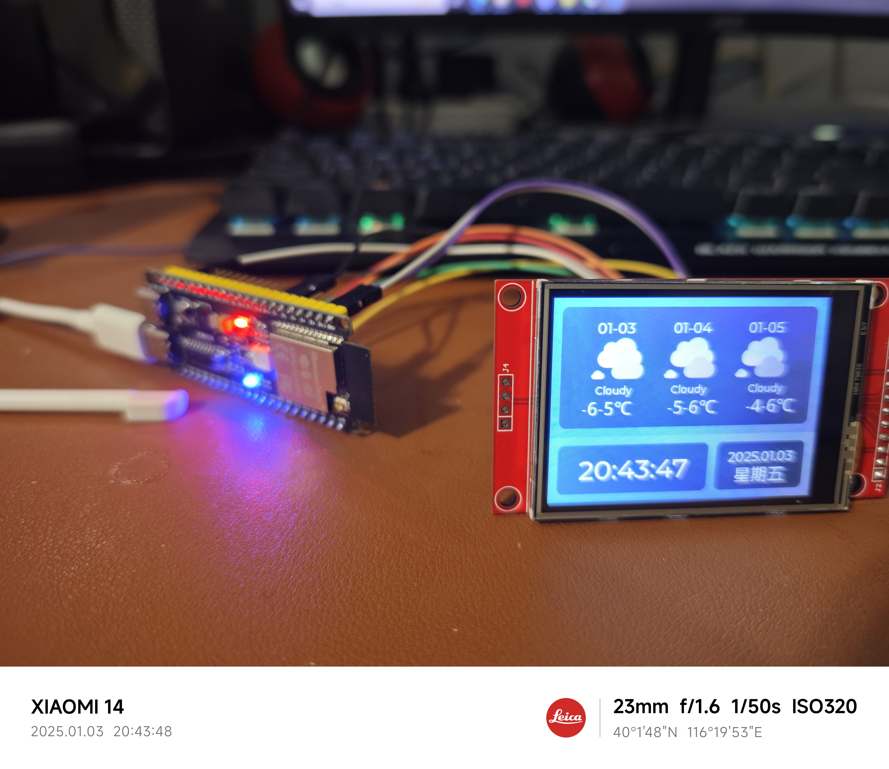
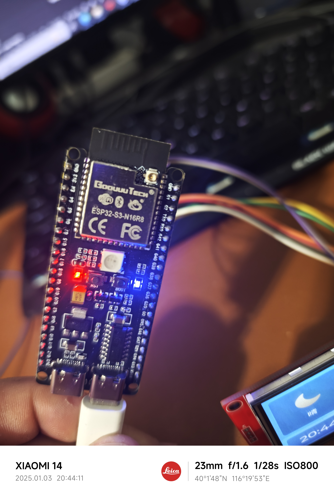

# ESP32-Weather-Clock
ESP32 Weather Clock based on LVGL （Arduino）.

Ardunio （PlatformIO）:
PLATFORM: Espressif 32 (2.0.0) > Espressif ESP32 Dev Module
HARDWARE: ESP32 240MHz, 320KB RAM, 4MB Flash
DEBUG: Current (esp-prog) External (esp-prog, iot-bus-jtag, jlink, minimodule, olimex-arm-usb-ocd, olimex-arm-usb-ocd-h, olimex-arm-usb-tiny-h, olimex-jtag-tiny, tumpa)
PACKAGES:
 - framework-arduinoespressif32 3.10004.200129 (1.0.4)
 - tool-esptoolpy 1.20600.0 (2.6.0)
 - tool-mkspiffs 2.230.0 (2.30)
 - toolchain-xtensa32 2.50200.80 (5.2.0)
  
 
Note：

基于LVGL （Arduino）

硬件：ESP32S3 + LCD（ILI9341 SPI屏）

支持心知天气和和风天气获取天气数据（需要自己申请账号），支持WIFI配网（默认WIFI热点为Clock）

 /* 和风天气 - https://dev.heweather.com */

HEFENG_KEY = "";//和风天气秘钥,替换成自己的秘钥

HEFENG_LOCATION = "101280306";//城市ID,可到https://where.heweather.com/index.html查询,替换成自己的城市ID

/* 心知天气 - https://www.seniverse.com */

SENIVERSE_KEY = "";//心知天气秘钥,替换成自己的秘钥

SENIVERSE_LOCATION = "Huicheng";//城市列表 https://docs.seniverse.com/api/start/start.html,替换成自己的城市名称

硬件接线：
Location:   .pio/libdeps/esp32-s3/TFT_eSPI/User_Setup.h
vcc接3.3v,GND接GND，LED接5v/3.3v就完成了，暂未实现触屏效果

WIFI配置：
src/main.cpp里wifiManager.autoConnect("","")里添加wifi名字和密码

成果展示:

